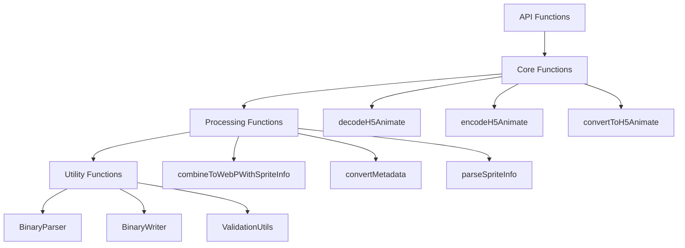

# 设计文档

## 概述

本设计实现了一个完整的 h5animate 编解码系统，包括格式编码器、解码器和从旧 .animate 格式的转换器。系统采用模块化架构，使用 TypeScript 开发，利用 Sharp 库进行高效的图像处理，并使用 Node.js 的 Buffer 和 DataView API 处理二进制数据。

## 架构

系统采用函数式架构设计：



### 核心组件

1. **API Functions**: 提供用户友好的接口函数
2. **Core Functions**: 核心编解码和转换逻辑
3. **Processing Functions**: 专门的处理函数
4. **Utility Functions**: 通用工具类和函数（BinaryParser、BinaryWriter、验证工具）

## 组件和接口

### 1. 核心数据类型

```typescript
// H5Animate 格式的元信息结构
interface H5AnimateMeta {
  ratio: number;
  frame: H5AnimateFrame[];
}

interface H5AnimateFrame {
  sound?: SoundMeta[];
  objects?: H5AnimateObject[];
}

interface SoundMeta {
  name: string;
  volume?: number;
  pitch?: number;
}

interface H5AnimateObject {
  index: number;
  x: number;
  y: number;
  scale: number;
  opacity: number;
  mirror?: number;
  rotate?: number;
}

// 精灵图信息
interface SpriteInfo {
  count: number;
  dimensions: Array<{ width: number; height: number }>;
}

// 旧格式的数据结构
interface LegacyAnimateFile {
  ratio: number;
  se?: string | { [frameNumber: number]: string };
  pitch?: { [frameNumber: number]: number };
  bitmaps: string[];
  frame_max: number;
  frames: FrameLayer[][];
}

type FrameLayer = [number, number, number, number, number, number?, number?];

// 解码结果
interface DecodedH5Animate {
  meta: H5AnimateMeta;
  spriteInfo: SpriteInfo;
  webpData: Buffer;
}
```

### 2. H5Animate 解码函数

```typescript
interface SpriteInfo {
  count: number;
  dimensions: Array<{ width: number; height: number }>;
}

interface DecodedH5Animate {
  meta: H5AnimateMeta;
  spriteInfo: SpriteInfo;
  webpData: Buffer;
}

/**
 * 解码 h5animate 文件
 */
async function decodeH5Animate(buffer: Buffer): Promise<DecodedH5Animate> {
  const parser = new BinaryParser(buffer);
  
  // 解析文件头
  const header = parseHeader(parser);
  
  // 解析精灵图元信息
  const spriteInfo = parseSpriteInfo(parser);
  
  // 提取 WebP 数据
  const remainingImageDataSize = header.imageDataSize - getSpriteInfoSize(spriteInfo);
  const webpData = parser.readBytes(remainingImageDataSize);
  
  // 提取并解析元信息
  const metaBuffer = parser.readBytes(header.metaDataSize);
  const metaJson = metaBuffer.toString('utf8');
  const rawMeta = JSON.parse(metaJson);
  
  // 将数组格式的对象数据转换回对象格式
  const meta = convertArraysToObjects(rawMeta) as H5AnimateMeta;
  
  return { meta, spriteInfo, webpData };
}

function parseHeader(parser: BinaryParser): FileHeader {
  const signature = parser.readString(4);
  if (signature !== 'ANIM') {
    throw new Error('Invalid file signature');
  }
  
  return {
    signature,
    version: parser.readUInt32LE(),
    imageDataSize: parser.readUInt32LE(),
    metaDataSize: parser.readUInt32LE()
  };
}

function parseSpriteInfo(parser: BinaryParser): SpriteInfo {
  const count = parser.readUInt32LE();
  const dimensions: Array<{ width: number; height: number }> = [];
  
  for (let i = 0; i < count; i++) {
    dimensions.push({
      width: parser.readUInt32LE(),
      height: parser.readUInt32LE()
    });
  }
  
  return { count, dimensions };
}

function getSpriteInfoSize(spriteInfo: SpriteInfo): number {
  return 4 + (spriteInfo.count * 8); // 4 bytes for count + 8 bytes per sprite (width + height)
}

function convertArraysToObjects(rawMeta: any): H5AnimateMeta {
  if (!rawMeta.frame) return rawMeta;
  
  return {
    ...rawMeta,
    frame: rawMeta.frame.map((frame: any) => ({
      ...frame,
      objects: frame.objects?.map((objArray: number[]) => ({
        index: objArray[0],
        x: objArray[1],
        y: objArray[2],
        scale: objArray[3],
        opacity: objArray[4],
        mirror: objArray[5] || 0,
        rotate: objArray[6] || 0
      }))
    }))
  };
}
```

### 3. H5Animate 编码函数

```typescript
/**
 * 编码为 h5animate 格式
 */
async function encodeH5Animate(meta: H5AnimateMeta, spriteInfo: SpriteInfo, webpData: Buffer): Promise<Buffer> {
  const metaJson = JSON.stringify(meta, (key, value) => {
    // 将 H5AnimateObject 转换为数组格式以节省空间
    if (key === 'objects' && Array.isArray(value)) {
      return value.map(obj => [
        obj.index,
        obj.x,
        obj.y,
        obj.scale,
        obj.opacity,
        obj.mirror || 0,
        obj.rotate || 0
      ]);
    }
    return value;
  });
  const metaBuffer = Buffer.from(metaJson, 'utf8');
  
  // 计算精灵图元信息大小
  const spriteInfoSize = getSpriteInfoSize(spriteInfo);
  const totalImageDataSize = spriteInfoSize + webpData.length;
  
  // 计算总大小
  const headerSize = 16; // 4 + 4 + 4 + 4
  const totalSize = headerSize + totalImageDataSize + metaBuffer.length;
  
  const writer = new BinaryWriter(totalSize);
  
  // 写入文件头
  writer.writeString('ANIM');
  writer.writeUInt32LE(1); // version
  writer.writeUInt32LE(totalImageDataSize);
  writer.writeUInt32LE(metaBuffer.length);
  
  // 写入精灵图元信息
  writer.writeUInt32LE(spriteInfo.count);
  for (const dimension of spriteInfo.dimensions) {
    writer.writeUInt32LE(dimension.width);
    writer.writeUInt32LE(dimension.height);
  }
  
  // 写入 WebP 数据
  writer.writeBuffer(webpData);
  
  // 写入元信息
  writer.writeBuffer(metaBuffer);
  
  return writer.getBuffer();
}
```

### 4. 格式转换函数

```typescript
interface ConversionResult {
  meta: H5AnimateMeta;
  spriteInfo: SpriteInfo;
  webpData: Buffer;
}

/**
 * 将旧格式转换为新格式
 */
async function convertToH5Animate(legacyData: LegacyAnimateFile): Promise<Buffer> {
  // 转换图像数据和生成精灵图信息
  const { webpData, spriteInfo } = await convertImages(legacyData.bitmaps);
  
  // 转换元信息
  const meta = convertMetadata(legacyData);
  
  // 编码为新格式
  return encodeH5Animate(meta, spriteInfo, webpData);
}

async function convertImages(bitmaps: string[]): Promise<{ webpData: Buffer; spriteInfo: SpriteInfo }> {
  const validBitmaps = bitmaps.filter(bitmap => bitmap.length > 0);
  const imageBuffers: Buffer[] = [];
  
  for (const bitmap of validBitmaps) {
    if (bitmap.startsWith('data:image/')) {
      const base64Data = bitmap.split(',')[1];
      const imageBuffer = Buffer.from(base64Data, 'base64');
      imageBuffers.push(imageBuffer);
    }
  }
  
  return combineToWebPWithSpriteInfo(imageBuffers);
}

function convertMetadata(legacy: LegacyAnimateFile): H5AnimateMeta {
  const frames: H5AnimateFrame[] = [];
  
  for (let i = 0; i < legacy.frame_max; i++) {
    const frameData = legacy.frames[i] || [];
    const frame: H5AnimateFrame = {};
    
    // 转换对象数据
    if (frameData.length > 0) {
      frame.objects = frameData.map(layer => ({
        index: layer[0],
        x: layer[1],
        y: layer[2],
        scale: layer[3],
        opacity: layer[4],
        mirror: layer[5] || 0,
        rotate: layer[6] || 0
      }));
    }
    
    // 转换音效数据
    frame.sound = convertSoundData(legacy, i);
    
    frames.push(frame);
  }
  
  return {
    ratio: legacy.ratio,
    frame: frames
  };
}

function convertSoundData(legacy: LegacyAnimateFile, frameIndex: number): SoundMeta[] | undefined {
  if (!legacy.se) return undefined;
  
  const sounds: SoundMeta[] = [];
  
  if (typeof legacy.se === 'string') {
    // 全局音效，只在第一帧添加
    if (frameIndex === 0) {
      sounds.push({ name: legacy.se });
    }
  } else {
    // 帧特定音效
    const soundName = legacy.se[frameIndex];
    if (soundName) {
      const sound: SoundMeta = { name: soundName };
      
      // 添加音调信息
      if (legacy.pitch && legacy.pitch[frameIndex] !== undefined) {
        sound.pitch = legacy.pitch[frameIndex];
      }
      
      sounds.push(sound);
    }
  }
  
  return sounds.length > 0 ? sounds : undefined;
}
```

### 5. WebP 处理函数

```typescript
/**
 * 将多个图像合并为单个 WebP 文件并生成精灵图信息
 */
async function combineToWebPWithSpriteInfo(imageBuffers: Buffer[]): Promise<{ webpData: Buffer; spriteInfo: SpriteInfo }> {
  if (imageBuffers.length === 0) {
    throw new Error('No images to process');
  }
  
  // 获取所有图像的尺寸
  const imageMetas = await Promise.all(
    imageBuffers.map(buffer => sharp(buffer).metadata())
  );
  
  // 创建精灵图信息
  const spriteInfo: SpriteInfo = {
    count: 1, // 目前只生成一个精灵图
    dimensions: []
  };
  
  if (imageBuffers.length === 1) {
    // 单个图像，直接转换
    const webpData = await sharp(imageBuffers[0])
      .webp({ lossless: true, quality: 100 })
      .toBuffer();
    
    spriteInfo.dimensions.push({
      width: imageMetas[0].width || 0,
      height: imageMetas[0].height || 0
    });
    
    return { webpData, spriteInfo };
  }
  
  // 多个图像，创建垂直排列的精灵图
  const webpData = await createVerticalSpriteSheet(imageBuffers, imageMetas);
  
  // 计算精灵图总尺寸
  const maxWidth = Math.max(...imageMetas.map(meta => meta.width || 0));
  const totalHeight = imageMetas.reduce((sum, meta) => sum + (meta.height || 0), 0);
  
  spriteInfo.dimensions.push({
    width: maxWidth,
    height: totalHeight
  });
  
  return { webpData, spriteInfo };
}

async function createVerticalSpriteSheet(imageBuffers: Buffer[], imageMetas: sharp.Metadata[]): Promise<Buffer> {
  // 计算精灵图尺寸（垂直排列）
  const maxWidth = Math.max(...imageMetas.map(meta => meta.width || 0));
  const totalHeight = imageMetas.reduce((sum, meta) => sum + (meta.height || 0), 0);
  
  // 创建空白画布
  const canvas = sharp({
    create: {
      width: maxWidth,
      height: totalHeight,
      channels: 4,
      background: { r: 0, g: 0, b: 0, alpha: 0 }
    }
  });
  
  // 准备合成操作
  const composite: sharp.OverlayOptions[] = [];
  let currentY = 0;
  
  for (let i = 0; i < imageBuffers.length; i++) {
    composite.push({
      input: imageBuffers[i],
      top: currentY,
      left: 0
    });
    currentY += imageMetas[i].height || 0;
  }
  
  return canvas
    .composite(composite)
    .webp({ lossless: true, quality: 100 })
    .toBuffer();
}

/**
 * 从 WebP 精灵图中提取单个帧
 */
async function extractFrame(
  webpBuffer: Buffer, 
  spriteInfo: SpriteInfo, 
  frameIndex: number, 
  frameHeight: number
): Promise<Buffer> {
  if (spriteInfo.count !== 1) {
    throw new Error('Multi-sprite extraction not yet supported');
  }
  
  const spriteWidth = spriteInfo.dimensions[0].width;
  
  return sharp(webpBuffer)
    .extract({
      left: 0,
      top: frameIndex * frameHeight,
      width: spriteWidth,
      height: frameHeight
    })
    .toBuffer();
}
```

### 6. 二进制解析和写入工具

```typescript
class BinaryParser {
  private view: DataView;
  private offset: number = 0;
  
  constructor(private buffer: Buffer) {
    this.view = new DataView(buffer.buffer, buffer.byteOffset, buffer.byteLength);
  }
  
  readUInt32LE(): number {
    const value = this.view.getUint32(this.offset, true);
    this.offset += 4;
    return value;
  }
  
  readString(length: number): string {
    const bytes = this.buffer.subarray(this.offset, this.offset + length);
    this.offset += length;
    return bytes.toString('ascii');
  }
  
  readBytes(length: number): Buffer {
    const bytes = this.buffer.subarray(this.offset, this.offset + length);
    this.offset += length;
    return bytes;
  }
  
  hasMore(): boolean {
    return this.offset < this.buffer.length;
  }
  
  getCurrentOffset(): number {
    return this.offset;
  }
}

class BinaryWriter {
  private buffer: Buffer;
  private offset: number = 0;
  
  constructor(totalSize: number) {
    this.buffer = Buffer.allocUnsafe(totalSize);
  }
  
  writeString(value: string): void {
    this.buffer.write(value, this.offset);
    this.offset += Buffer.byteLength(value);
  }
  
  writeUInt32LE(value: number): void {
    this.buffer.writeUInt32LE(value, this.offset);
    this.offset += 4;
  }
  
  writeBuffer(source: Buffer): void {
    source.copy(this.buffer, this.offset);
    this.offset += source.length;
  }
  
  getBuffer(): Buffer {
    return this.buffer;
  }
  
  getCurrentOffset(): number {
    return this.offset;
  }
}
```

## 数据模型

### 文件格式结构

```
H5Animate File Structure:
┌─────────────────────────────────────┐
│ Header (16 bytes)                   │
├─────────────────────────────────────┤
│ - Signature: "ANIM" (4 bytes)       │
│ - Version: uint32 (4 bytes)         │
│ - Image Data Size: uint32 (4 bytes) │
│ - Meta Data Size: uint32 (4 bytes)  │
├─────────────────────────────────────┤
│ Sprite Info (variable)              │
├─────────────────────────────────────┤
│ - Sprite Count: uint32 (4 bytes)    │
│ - Sprite 1 Width: uint32 (4 bytes)  │
│ - Sprite 1 Height: uint32 (4 bytes) │
│ - ... (repeat for each sprite)      │
├─────────────────────────────────────┤
│ WebP Image Data (variable)          │
├─────────────────────────────────────┤
│ JSON Metadata (variable)            │
└─────────────────────────────────────┘
```

注意：Image Data Size 包含了 Sprite Info 和 WebP Image Data 的总大小。

### 转换映射

| 旧格式字段 | 新格式字段 | 转换逻辑 |
|-----------|-----------|----------|
| `ratio` | `ratio` | 直接复制 |
| `bitmaps[]` | WebP数据 + 精灵图信息 | Base64解码 → PNG → WebP合并 + 生成精灵图元信息 |
| `frames[i][j][0]` | `objects[j][0]` | 数组索引0：图片索引 |
| `frames[i][j][1]` | `objects[j][1]` | 数组索引1：X坐标 |
| `frames[i][j][2]` | `objects[j][2]` | 数组索引2：Y坐标 |
| `frames[i][j][3]` | `objects[j][3]` | 数组索引3：缩放值 |
| `frames[i][j][4]` | `objects[j][4]` | 数组索引4：透明度 |
| `frames[i][j][5]` | `objects[j][5]` | 数组索引5：镜像（默认0） |
| `frames[i][j][6]` | `objects[j][6]` | 数组索引6：旋转（默认0） |
| `se` (string) | `sound[0].name` | 仅第一帧 |
| `se[frameNum]` | `sound[].name` | 按帧映射 |
| `pitch[frameNum]` | `sound[].pitch` | 按帧映射 |

**注意**: 在文件存储中，H5AnimateObject 被序列化为数组格式 `[index, x, y, scale, opacity, mirror, rotate]` 以节省存储空间。在内存中使用时会转换回对象格式以提供更好的类型安全性和可读性。

## 正确性属性

*属性是一个特征或行为，应该在系统的所有有效执行中保持为真——本质上是关于系统应该做什么的正式声明。属性作为人类可读规范和机器可验证正确性保证之间的桥梁。*

基于对验收标准的分析，我识别出以下可测试的正确性属性。经过属性反思，我合并了逻辑上冗余的属性以确保每个属性提供独特的验证价值。

### 属性反思

在分析所有可测试的验收标准后，我识别出以下冗余模式并进行了合并：

- **编码/解码往返属性**: 需求 2.5 和 3.5 都涉及往返测试，可以合并为一个综合的往返属性
- **错误处理属性**: 需求 1.6、2.6、3.6、6.1-6.5 都涉及错误处理，可以合并为几个综合的错误处理属性
- **数据验证属性**: 多个需求涉及数据格式验证，可以合并为更全面的验证属性

### 核心正确性属性

**属性 1: H5Animate 编解码往返一致性**
*对于任何*有效的动画元数据、精灵图信息和 WebP 数据，编码后再解码应该产生等价的原始数据
**验证需求: 需求 2.5, 3.5**

**属性 2: 文件头验证和解析**
*对于任何*具有有效 "ANIM" 标识符的 h5animate 文件，解码器应该成功解析文件头并提取正确的版本和大小信息
**验证需求: 需求 1.1, 1.2**

**属性 3: 数据段正确提取**
*对于任何*有效的 h5animate 文件，解码器应该根据头部信息准确提取精灵图信息、WebP 数据和元信息，且提取的字节数与头部声明的大小一致
**验证需求: 需求 1.3, 1.4**

**属性 4: 结构化数据完整性**
*对于任何*成功解码的 h5animate 文件，返回的结构化数据应该包含所有必需字段（ratio、frame 数组和精灵图信息）
**验证需求: 需求 1.5**

**属性 5: 编码器文件头和精灵图信息生成**
*对于任何*有效的输入数据，编码器应该生成包含正确 "ANIM" 标识符、版本号、准确数据大小和完整精灵图信息的标准文件
**验证需求: 需求 2.1, 2.2, 2.3, 2.4**

**属性 6: 旧格式解析和转换**
*对于任何*有效的 .animate 文件，转换器应该成功解析 JSON 结构并将所有数据正确转换为新格式
**验证需求: 需求 3.1, 3.3, 3.4**

**属性 7: 图像格式转换**
*对于任何*包含 Base64 编码 PNG 图片的旧格式数据，转换器应该将它们正确转换为单个 WebP 文件
**验证需求: 需求 3.2**

**属性 8: WebP 图像处理和精灵图生成**
*对于任何*一组 PNG 图像，WebP 处理器应该能够将它们合并为单个 WebP 文件，生成正确的精灵图信息，并支持后续的帧提取
**验证需求: 需求 4.1, 4.3**

**属性 9: 透明度保持**
*对于任何*包含透明度信息的图像，WebP 处理器应该在转换过程中保持 alpha 通道信息
**验证需求: 需求 4.4**

**属性 10: 压缩模式支持**
*对于任何*输入图像，WebP 处理器应该支持无损和有损两种压缩模式
**验证需求: 需求 4.5**

**属性 11: 元信息验证和映射**
*对于任何*元信息数据，解析器应该验证 JSON 结构完整性，确保必需字段存在，并为可选字段提供正确的默认值
**验证需求: 需求 5.1, 5.2, 5.4**

**属性 12: 对象属性映射**
*对于任何*旧格式的图层数据，元信息解析器应该正确映射所有坐标、缩放、透明度等属性到新格式
**验证需求: 需求 5.3**

**属性 13: 错误处理和描述**
*对于任何*无效输入（文件格式错误、数据损坏、类型不匹配、字段缺失），系统应该返回具体的错误描述，包含错误类型、位置和期望值
**验证需求: 需求 1.6, 2.6, 3.6, 6.1, 6.2, 6.3, 6.4**

**属性 14: 错误代码唯一性**
*对于任何*错误类型，系统应该提供唯一的错误代码以便程序化处理
**验证需求: 需求 6.5**

## 错误处理

系统采用分层错误处理策略：

### 错误类型和代码

```typescript
enum H5AnimateErrorCode {
  INVALID_SIGNATURE = 'H5A001',
  INVALID_VERSION = 'H5A002',
  CORRUPTED_HEADER = 'H5A003',
  INVALID_IMAGE_DATA = 'H5A004',
  INVALID_METADATA = 'H5A005',
  CONVERSION_FAILED = 'H5A006',
  WEBP_PROCESSING_ERROR = 'H5A007',
  VALIDATION_ERROR = 'H5A008'
}

class H5AnimateError extends Error {
  constructor(
    public code: H5AnimateErrorCode,
    message: string,
    public position?: number,
    public expectedType?: string,
    public missingFields?: string[]
  ) {
    super(message);
    this.name = 'H5AnimateError';
  }
}
```

### 验证策略

1. **输入验证**: 在处理前验证所有输入参数
2. **格式验证**: 验证文件格式和结构完整性
3. **数据验证**: 验证数据类型和值范围
4. **资源验证**: 验证系统资源可用性

## 测试策略

### 基于示例的测试方法

考虑到 h5animate 编解码功能相对简单直接，主要涉及数据格式转换而非复杂计算，采用基于示例的测试方法更为合适：

**单元测试**:
- 验证特定的编解码示例
- 测试边界情况和错误条件
- 验证组件集成点
- 测试往返一致性（编码后解码）

**集成测试**:
- 使用真实的 .animate 文件进行转换测试
- 验证完整的工作流程
- 测试不同大小和复杂度的动画文件

### 测试库配置

使用 **Vitest** 作为主要测试框架：

```typescript
import { describe, test, expect } from 'vitest';

// 示例测试
describe('H5Animate Codec', () => {
  test('should encode and decode simple animation data', async () => {
    const meta: H5AnimateMeta = {
      ratio: 2,
      frame: [
        {
          objects: [
            { index: 0, x: 10, y: 20, scale: 100, opacity: 255, mirror: 0, rotate: 0 }
          ]
        }
      ]
    };
    
    const spriteInfo: SpriteInfo = {
      count: 1,
      dimensions: [{ width: 100, height: 100 }]
    };
    
    const webpData = Buffer.from('fake-webp-data');
    
    const encoded = await encodeH5Animate(meta, spriteInfo, webpData);
    const decoded = await decodeH5Animate(encoded);
    
    expect(decoded.meta).toEqual(meta);
    expect(decoded.spriteInfo).toEqual(spriteInfo);
    expect(decoded.webpData).toEqual(webpData);
  });
  
  test('should convert legacy format to h5animate', async () => {
    const legacyData: LegacyAnimateFile = {
      ratio: 2,
      se: 'attack.mp3',
      bitmaps: ['data:image/png;base64,iVBORw0KGgo...'],
      frame_max: 1,
      frames: [[[0, 0, 0, 30, 120]]]
    };
    
    const result = await convertToH5Animate(legacyData);
    const decoded = await decodeH5Animate(result);
    
    expect(decoded.meta.ratio).toBe(2);
    expect(decoded.meta.frame).toHaveLength(1);
    expect(decoded.meta.frame[0].objects).toHaveLength(1);
    expect(decoded.meta.frame[0].objects![0]).toEqual({
      index: 0, x: 0, y: 0, scale: 30, opacity: 120, mirror: 0, rotate: 0
    });
  });
});
```

### 测试覆盖范围

**核心功能测试**:
1. 基本编码/解码往返测试
2. 精灵图信息处理测试
3. 旧格式转换测试
4. 数组/对象格式转换测试

**边界情况测试**:
1. 空动画数据
2. 单帧动画
3. 多帧复杂动画
4. 缺失可选字段的处理

**错误处理测试**:
1. 无效文件签名
2. 损坏的文件数据
3. 无效的 JSON 元信息
4. 图像处理错误

现在我需要使用 prework 工具来分析验收标准的可测试性：

<function_calls>
<invoke name="prework">
<parameter name="featureName">h5animate-codec