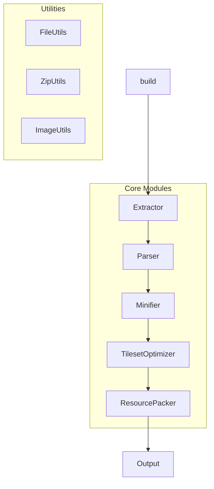
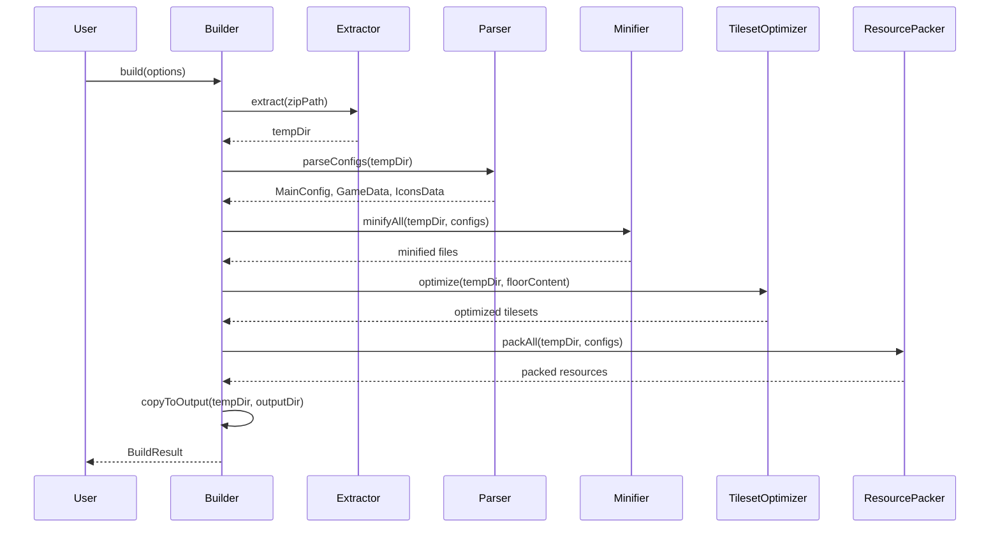

# Design Document: Mota Builder

## Overview

Mota Builder 是一个纯函数式的魔塔游戏打包工具，通过单一的 `build` 函数入口，将魔塔游戏压缩包转换为优化后的可发布格式。

### 设计原则

- **纯函数式 API**: 单一 `build` 函数，无副作用
- **模块化架构**: 每个功能独立模块，职责单一
- **流式处理**: 使用 async/await 和 Promise.all 优化性能
- **错误透明**: 不静默吞掉错误，提供清晰的中文错误信息
- **可扩展性**: 为未来格式变更预留扩展点

### 未来扩展预留

1. **打包格式扩展**: 当前使用 ZIP (.h5data)，未来计划支持 TAR + Zstd/Brotli 预压缩
2. **图片格式扩展**: 当前保持原格式，未来计划实验性支持 WebP 转换
3. **项目版本兼容**: 当前支持 2.x 格式，未来需要支持新的地图/数据存储格式

## Architecture



### 处理流程



## Components and Interfaces

### 1. Builder (src/builder.ts)

主入口模块，协调整个构建流程。

```typescript
interface BuildContext {
  tempDir: string;
  rootDir: string;
  mainConfig: MainConfig;
  gameData: GameData;
  iconsData: IconsData;
  logger: Logger;
  options: CompressOptions;
}

async function build(options: BuildOptions): Promise<BuildResult>;
```

### 1.5 Logger (src/logger.ts)

日志模块，提供格式化的构建进度输出。使用 group/groupEnd 模式管理层级。

```typescript
class Logger {
  constructor(output?: (message: string) => void);

  // 开始一个分组（自动增加缩进）
  group(title: string): void;

  // 结束当前分组（自动减少缩进）
  groupEnd(): void;

  // 普通日志
  log(text: string): void;

  // 成功消息（如 "======> 所有核心文件已压缩"）
  success(text: string): void;

  // 警告消息
  warn(text: string): void;

  // 错误消息
  error(text: string): void;
}

// 工具函数
function formatSize(bytes: number): string;  // "1.23MB"
function formatTimestamp(): string;  // "[2024-01-01 12:00:00]"
```

**使用示例**:
```typescript
logger.group('抽取源信息');
logger.log('抽取 main.js');
logger.log('抽取 project/data.js');
logger.groupEnd();
logger.success('所有核心文件已压缩到 libs/libs.min.js');
```

### 2. Extractor (src/extractor.ts)

负责解压 ZIP 文件并定位游戏根目录。

```typescript
interface ExtractResult {
  tempDir: string;
  rootDir: string;
}

async function extract(zipPath: string): Promise<ExtractResult>;
async function findRootDir(extractedDir: string): Promise<string>;
```

### 3. Parser (src/parser.ts)

负责解析游戏配置文件。

```typescript
// 2.x 版本解析器（当前实现）
function parseMainJs2X(content: string): MainConfig;
function parseDataJs2X(content: string): GameData;
function parseIconsJs2X(content: string): IconsData;

// 3.x 版本解析器（未来实现）
// function parseMainJs3X(content: string): MainConfig;
// function parseDataJs3X(content: string): GameData;
// function parseIconsJs3X(content: string): IconsData;

// 自动检测版本并调用对应解析器
async function detectVersion(rootDir: string): Promise<'2.x' | '3.x'>;
async function parseMainJs(filePath: string): Promise<MainConfig>;
async function parseDataJs(filePath: string): Promise<GameData>;
async function parseIconsJs(filePath: string): Promise<IconsData>;
```

**解析策略**:
- main.js: 使用正则表达式提取 `this.loadList=[...]` 等配置
- data.js: 跳过第一行变量声明，解析 JSON 内容
- icons.js: 跳过第一行变量声明，解析 JSON 中的 autotile 字段
- 内部通过版本检测自动选择对应解析器

### 4. Minifier (src/minifier.ts)

负责压缩合并 JavaScript 文件。

```typescript
interface MinifyResult {
  libsContent: string;
  projectContent: string;
  floorsContent: string;
}

async function minifyLibs(rootDir: string, loadList: string[]): Promise<string>;
async function minifyProject(rootDir: string, pureData: string[]): Promise<string>;
async function minifyFloors(rootDir: string, floorIds: string[]): Promise<string>;
async function minifyAll(ctx: BuildContext): Promise<MinifyResult>;
```

**压缩策略**:
- 使用 terser 进行 JS 压缩
- 合并多个文件时添加分号分隔
- libs.min.js 末尾追加 localForage 初始化代码

### 5. TilesetOptimizer (src/tilesetOptimizer.ts)

负责优化 tileset 图片。

```typescript
interface TilesetInfo {
  filename: string;
  usedTileIds: number[];
  startIndex: number;
}

async function extractUsedTileIds(floorsContent: string): Promise<Set<number>>;
async function optimizeTileset(
  tilesetPath: string,
  usedIds: Set<number>,
  startIndex: number
): Promise<void>;
async function optimizeAll(ctx: BuildContext, floorsContent: string): Promise<void>;
```

**优化算法**:
1. 从 floors.min.js 提取所有 5 位以上数字
2. 每个 tileset 从 10000 * index 开始编号
3. 计算实际使用的 tile 位置
4. 裁剪图片只保留使用的行

### 6. ResourcePacker (src/resourcePacker.ts)

负责打包资源文件。

```typescript
// 当前实现：ZIP 打包
async function packZip(files: FileEntry[], outputPath: string): Promise<void>;

// 未来实现：TAR + Zstd 打包
// async function packTarZstd(files: FileEntry[], outputPath: string): Promise<void>;

interface PackOptions {
  sourceDir: string;
  files: string[];
  outputName: string;
  extension?: string;  // 默认 '.h5data'
  transform?: (filename: string) => string;
}

async function packResources(options: PackOptions): Promise<void>;
async function packWithChunks(
  options: PackOptions,
  chunkThreshold: number
): Promise<string[]>;
async function packAll(ctx: BuildContext): Promise<Record<string, string[]>>;
```

**打包策略**:
- 默认使用 .h5data 扩展名（实际是 ZIP 格式）
- 如果 libs.min.js 包含 "images.zip"，使用 .zip 扩展名
- 分块压缩时每块不超过 2MB
- 内部预留 TAR+Zstd/Brotli 函数位置

### 7. ImageUtils (src/utils/image-utils.ts)

图片处理工具函数。

```typescript
interface ImageOptions {
  quality?: number;
  palette?: boolean;  // PNG 调色板模式
}

// 当前实现：保持原格式压缩
async function compressImageOriginal(imagePath: string, options?: ImageOptions): Promise<boolean>;

// 未来实现：WebP 转换
// async function convertToWebP(imagePath: string, outputPath: string, options?: ImageOptions): Promise<void>;

async function compressImage(imagePath: string): Promise<boolean>;
async function createTransparentImage(outputPath: string, width: number, height: number): Promise<void>;
async function cropImage(
  imagePath: string,
  x: number,
  y: number,
  width: number,
  height: number
): Promise<Buffer>;
```

### 8. ZipUtils (src/utils/zip-utils.ts)

ZIP 文件处理工具函数。

```typescript
async function extractZip(zipPath: string, destDir: string): Promise<void>;
async function createZip(files: string[], outputPath: string): Promise<void>;
async function decodeGbkFilename(buffer: Buffer): string;
```

### 9. FileUtils (src/utils/file-utils.ts)

文件操作工具函数。

```typescript
async function ensureDir(dirPath: string): Promise<void>;
async function copyDir(src: string, dest: string): Promise<void>;
async function removeDir(dirPath: string): Promise<void>;
async function formatSize(bytes: number): string;
```

## Data Models

### BuildOptions

```typescript
interface BuildOptions {
  input: string;           // 输入 ZIP 文件路径
  output: string;          // 输出目录
  options?: CompressOptions;
  logger?: (message: string) => void;
}
```

### CompressOptions

```typescript
interface CompressOptions {
  minify?: boolean;        // 是否压缩 JS，默认 true
  compressImages?: boolean; // 是否压缩图片，默认 true
  splitChunks?: boolean;   // 是否分块，默认 false
  chunkThreshold?: number; // 分块阈值，默认 2MB
}
```

### MainConfig

```typescript
interface MainConfig {
  loadList: string[];
  pureData: string[];
  materials: string[];
  enableSplitChunks: boolean;
  skipResourcePackage: boolean;
}
```

### GameData

```typescript
interface GameData {
  floorIds: string[];
  images: string[];
  tilesets: string[];
  animates: string[];
  sounds: string[];
  bgms: string[];
  name: string;
}
```

### BuildResult

```typescript
interface BuildResult {
  success: boolean;
  outputDir: string;
  error?: string;
  stats?: BuildStats;
}

interface BuildStats {
  originalSize: number;
  compressedSize: number;
  duration: number;
}
```


## Correctness Properties

*A property is a characteristic or behavior that should hold true across all valid executions of a system—essentially, a formal statement about what the system should do. Properties serve as the bridge between human-readable specifications and machine-verifiable correctness guarantees.*

### Property 1: ZIP Extraction Preserves All Files

*For any* valid ZIP file containing N files, extracting it SHALL produce exactly N files in the output directory with identical content.

**Validates: Requirements 1.1**

### Property 2: GBK Filename Decoding

*For any* ZIP file with GBK-encoded filenames, the extracted filenames SHALL be valid UTF-8 strings matching the original intended names.

**Validates: Requirements 1.2**

### Property 3: Root Directory Detection

*For any* extracted ZIP with nested directory structure, the detected root directory SHALL contain a main.js file.

**Validates: Requirements 1.5**

### Property 4: Config Parsing Round-Trip

*For any* valid main.js/data.js/icons.js content, parsing then reconstructing the config values SHALL produce equivalent data structures.

**Validates: Requirements 2.1, 2.2, 2.3**

### Property 5: JS Minification Content Preservation

*For any* list of JS files, the minified output SHALL contain all variable declarations and function definitions from the source files (semantic preservation).

**Validates: Requirements 3.1, 3.2, 3.3**

### Property 6: Resource Packing Completeness

*For any* resource type and file list, the created ZIP archive SHALL contain exactly the files in the list that exist on disk.

**Validates: Requirements 4.1, 4.2, 4.3, 4.4, 4.5, 4.6**

### Property 7: Extension Selection

*For any* libs.min.js content, if it contains the string "images.zip", all resource packages SHALL use .zip extension; otherwise they SHALL use .h5data extension.

**Validates: Requirements 4.7**

### Property 8: Split Chunks Threshold and Naming

*For any* resource set with total size exceeding the chunk threshold when splitChunks is enabled, the output SHALL be split into multiple files named {type}-{index}.{ext} where each chunk is under the threshold.

**Validates: Requirements 5.1, 5.2**

### Property 9: Tileset ID Extraction

*For any* floors.min.js content containing 5+ digit numbers, the TilesetOptimizer SHALL extract all such numbers as potential tileset IDs, and for each tileset starting at index N, only IDs in range [10000*N, 10000*(N+1)) SHALL be considered.

**Validates: Requirements 6.1, 6.2, 6.5**

### Property 10: Tileset Optimization Size Reduction

*For any* tileset image with unused tile regions, the optimized image height SHALL be less than or equal to the original height.

**Validates: Requirements 6.3**

### Property 11: Image Compression Threshold

*For any* PNG or JPG image exceeding 256KB, the ResourcePacker SHALL attempt compression, and the output file size SHALL be less than or equal to the original.

**Validates: Requirements 7.1, 7.2**

### Property 12: Build Output Completeness

*For any* successful build, the output directory SHALL contain all files from the processed game directory.

**Validates: Requirements 8.1, 8.2**

### Property 13: Temporary File Cleanup

*For any* build (successful or failed), the temporary directory SHALL be removed after the build function returns.

**Validates: Requirements 8.4**

## Error Handling

### Error Types

```typescript
class MotaBuilderError extends Error {
  constructor(
    message: string,
    public readonly code: ErrorCode,
    public readonly details?: Record<string, unknown>
  ) {
    super(message);
    this.name = 'MotaBuilderError';
  }
}

enum ErrorCode {
  ZIP_NOT_FOUND = 'ZIP_NOT_FOUND',
  ZIP_INVALID = 'ZIP_INVALID',
  ZIP_CORRUPTED = 'ZIP_CORRUPTED',
  ROOT_NOT_FOUND = 'ROOT_NOT_FOUND',
  CONFIG_MISSING = 'CONFIG_MISSING',
  CONFIG_INVALID = 'CONFIG_INVALID',
  MINIFY_FAILED = 'MINIFY_FAILED',
  RESOURCE_TOO_LARGE = 'RESOURCE_TOO_LARGE',
  IMAGE_PROCESS_FAILED = 'IMAGE_PROCESS_FAILED',
  OUTPUT_FAILED = 'OUTPUT_FAILED',
}
```

### Error Messages (Chinese)

| Code | Message |
|------|---------|
| ZIP_NOT_FOUND | 压缩文件不存在：{path} |
| ZIP_INVALID | 不是有效的 ZIP 文件：{path} |
| ZIP_CORRUPTED | ZIP 文件已损坏：{path} |
| ROOT_NOT_FOUND | 找不到游戏根目录（缺少 main.js） |
| CONFIG_MISSING | 配置文件缺失：{file} |
| CONFIG_INVALID | 配置文件格式错误：{file}，{reason} |
| MINIFY_FAILED | JS 压缩失败：{file}，{reason} |
| RESOURCE_TOO_LARGE | 资源文件过大：{file}（{size}），请启用分块压缩 |
| IMAGE_PROCESS_FAILED | 图片处理失败：{file}，{reason} |
| OUTPUT_FAILED | 输出失败：{reason} |

### Error Handling Strategy

1. **Fail Fast**: 关键错误（ZIP 无效、配置缺失）立即终止
2. **Graceful Degradation**: 非关键错误（图片压缩失败）记录警告并继续
3. **Error Aggregation**: 收集所有错误后统一报告
4. **Cleanup on Error**: 确保临时文件在错误时也被清理

## Testing Strategy

### Testing Framework

- **Unit Tests**: Vitest
- **Minimum iterations**: 手动编写关键测试用例

### Test Structure

```
tests/
├── unit/
│   ├── extractor.test.ts
│   ├── parser.test.ts
│   ├── minifier.test.ts
│   ├── tileset-optimizer.test.ts
│   ├── resource-packer.test.ts
│   └── utils/
│       ├── image-utils.test.ts
│       ├── zip-utils.test.ts
│       └── file-utils.test.ts
└── fixtures/
    ├── sample-game.zip
    ├── gbk-filenames.zip
    └── configs/
        ├── main.js
        ├── data.js
        └── icons.js
```

### Unit Test Coverage

- Specific examples demonstrating correct behavior
- Edge cases (empty inputs, boundary values)
- Error conditions and error messages
- Integration points between modules

### Test Fixtures

需要准备以下测试数据：
- 有效的魔塔游戏 ZIP 包
- 包含 GBK 编码文件名的 ZIP
- 各种配置文件样例
- 不同大小的图片文件
- 损坏的 ZIP 文件
